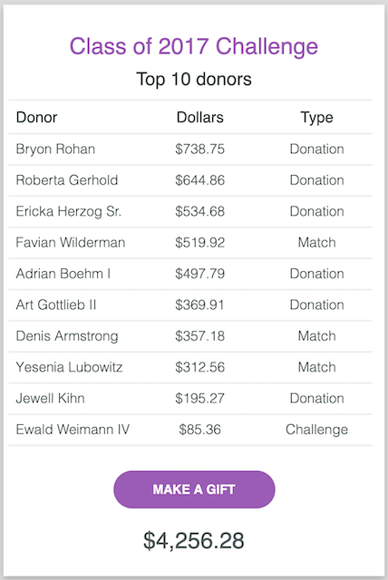

# CampaignCard 
 
- Build a campaign card front and back using HTML, CSS, and JavaScript
  
   
  

## Installation

  - npm install will install all module dependencies in package.json
    
    ```
      npm install
    ```


# 